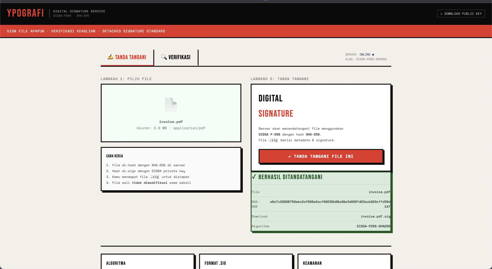
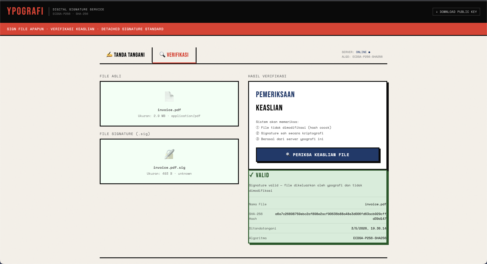
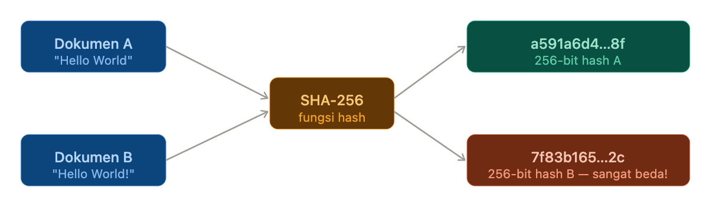
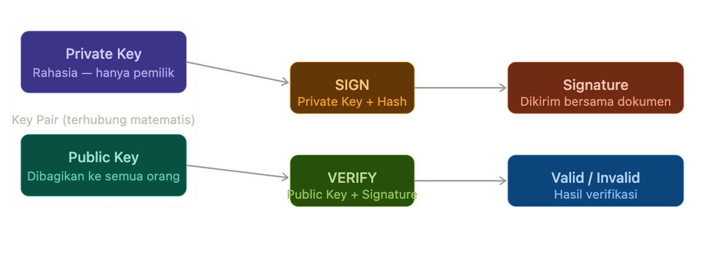
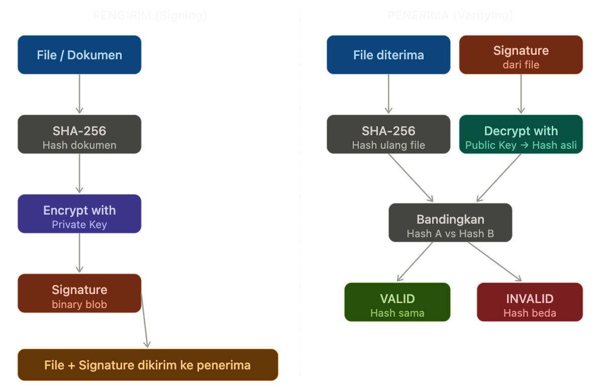

## Konsep Digital Signature & Komponen-komponennya




### Cryptographic Hash — "Sidik Jari" Dokumen

Bayangkan kamu punya dokumen 100 halaman. Daripada membandingkan seluruh isinya untuk tahu apakah ada yang berubah, kamu menjalankan dokumen itu melalui sebuah fungsi matematika khusus yang menghasilkan "sidik jari" berukuran tetap — misalnya 32 byte (256 bit). Inilah yang disebut **hash**.

Properti kritis hash yang baik (seperti SHA-256 atau SHA-3): pertama, **deterministik** — input yang sama selalu menghasilkan output yang sama. Kedua, **avalanche effect** — mengubah satu bit di input mengubah ~50% bit di output secara tidak terduga. Ketiga, **one-way** — kamu tidak bisa membalikkan hash untuk mendapatkan input aslinya. Keempat, **collision resistant** — hampir mustahil menemukan dua input berbeda yang menghasilkan hash sama.



### Asymmetric Cryptography — Kunci Publik & Privat

Ini adalah jantung dari digital signature. Ide dasarnya sangat elegan: kamu punya **dua kunci yang secara matematis terhubung**. Apa yang di-*lock* dengan satu kunci, hanya bisa di-*unlock* dengan kunci pasangannya — dan tidak ada cara efisien untuk menurunkan kunci privat dari kunci publik.

**RSA** (Rivest–Shamir–Adleman) bekerja dengan mendispersi kesulitan memfaktorkan bilangan prima besar. **ECDSA** (Elliptic Curve DSA) yang lebih modern bekerja di atas kurva eliptik, memberikan keamanan setara RSA dengan kunci yang jauh lebih pendek (256-bit ECDSA ≈ 3072-bit RSA dalam hal keamanan).



### Bagaimana Digital Signature Bekerja — Alur Lengkap

Sekarang kita gabungkan dua konsep di atas. Proses signing sebenarnya sangat logis bila dipikirkan: kamu tidak bisa "mengenkripsi" dokumen besar dengan private key (terlalu lambat), jadi kamu hash dulu dokumennya untuk mendapat representasi kecil yang unik, lalu enkripsi hash itu saja dengan private key. Hasilnya adalah signature.

Proses verifikasi adalah kebalikannya secara elegan: penerima mendekripsi signature dengan public key untuk mendapatkan hash asli, lalu menghitung ulang hash dari dokumen yang diterima, dan membandingkan keduanya. Kalau sama → dokumen tidak dimodifikasi dan benar-benar ditandatangani oleh pemegang private key tersebut.



### Dimana Signature Disimpan? — Standard Industri

Ini pertanyaan yang bagus dan sering membingungkan. Ada tiga pendekatan yang umum digunakan di industri, dan pilihan tergantung pada jenis file-nya.

**Embedded (in-band)** adalah cara paling umum untuk format file yang punya struktur internal seperti PDF, Word, atau XML. Signature disimpan *di dalam* file itu sendiri, di sebuah field/section yang sudah dirancang untuk itu. PDF misalnya punya section `/ByteRange` dan `/Contents` khusus untuk ini. File "utuh" tetap satu — kamu tidak perlu file kedua.

**Detached signature (.sig/.p7s file)** adalah pendekatan untuk binary files, gambar, software installer, atau file yang tidak punya struktur internal untuk menyimpan signature. Kamu mendistribusikan dua file: `dokumen.pdf` dan `dokumen.pdf.sig`. Untuk verifikasi, kamu butuh keduanya. Cara ini juga lebih mudah karena tidak mengubah file asli sama sekali.

**Manifest / sidecar metadata** adalah pendekatan modern seperti yang dipakai di container images (Docker), package manager, atau code signing untuk distribusi software. Sebuah file manifest berisi daftar semua file beserta hash-nya, dan manifest itu sendiri yang di-sign.

Untuk project **ypografi** ini, kita akan implementasikan yang paling industry-standard: **detached signature**. Mengapa? Karena ini bekerja untuk semua jenis file (gambar, PDF, biner, teks, dll), tidak memodifikasi file asli, dan mudah diverifikasi oleh pihak lain. Signature disimpan dalam format PEM yang human-readable di file terpisah.

---

## Apa yang Ada di Dalam `main.go`

### Struktur & Alur Keseluruhan

File ini adalah satu program Go yang menjalankan HTTP server lengkap dengan semua logika kriptografi di dalamnya — tidak ada dependency eksternal sama sekali, murni menggunakan `crypto/ecdsa`, `crypto/sha256`, dan library standard library Go.

**Cara menjalankan:**
```bash
go run main.go
# Buka http://localhost:8080
```

Pertama kali dijalankan, server otomatis membuat `private.pem` (mode `0600`, hanya bisa dibaca server) dan `public.pem` (bisa dibagikan ke siapapun).

---

### Pilihan Algoritma: Mengapa ECDSA P-256?

Kita memakai **ECDSA** (Elliptic Curve Digital Signature Algorithm) di kurva **P-256** (secp256r1). Ini adalah kombinasi yang dipakai oleh TLS modern, JWT `ES256`, Apple Pay, dan banyak sistem industri. Alasannya: security setara RSA-3072 namun private key-nya hanya 32 byte, signature-nya hanya 64-72 byte (jauh lebih kompak dari RSA yang bisa 384 byte), dan operasinya lebih cepat. Untuk hash kita pakai **SHA-256** yang menghasilkan digest 32 byte — cukup untuk menangkap perubahan sekecil apapun pada file.

---

### Dimana Signature Disimpan? — Detached Signature

Jawaban untuk kebingungan kamu: kita menggunakan **detached signature** — file signature (`.sig`) disimpan terpisah dari file aslinya. Jadi kalau kamu sign `laporan.pdf`, kamu akan mendapat dua file: `laporan.pdf` (tidak berubah sama sekali) dan `laporan.pdf.sig` (berisi signature + metadata).

File `.sig` ini bukan sekadar bytes biner mentah — kita membungkusnya dalam **JSON dengan metadata lengkap** (`SignatureMetadata`), sehingga self-contained dan human-readable:

```json
{
  "version": "1.0",
  "algorithm": "ECDSA-P256-SHA256",
  "signed_at": "2026-05-03T09:00:00Z",
  "file_hash": "a3f8b2...",
  "file_name": "laporan.pdf",
  "file_size": 245760,
  "signature": "MEQCIC...",
  "public_key": "MFkwEw..."
}
```

Yang menarik: kita menyimpan **public key di dalam .sig file** juga (base64 encoded). Ini disebut "self-contained verification" — siapapun bisa verifikasi file tanpa perlu menghubungi server kita, cukup dengan file asli dan .sig-nya. Tapi endpoint `/verify` kita juga mengecek apakah public key di .sig cocok dengan server key kita, sehingga bisa membedakan antara "valid secara kriptografi" dan "valid DAN dikeluarkan oleh server ypografi ini" — dua kondisi berbeda yang ditampilkan berbeda di UI.

---

### Tiga Endpoint Utama

`POST /sign` menerima file upload, menghitung SHA-256 hash, menandatangani dengan ECDSA private key, dan mengembalikan file `.sig` sebagai download langsung. File asli tidak disimpan di server.

`POST /verify` menerima dua file: file asli dan file `.sig`. Pertama ia hash ulang file yang diupload, lalu bandingkan dengan hash di metadata `.sig` (deteksi modifikasi). Kalau hash cocok, baru ia melakukan verifikasi kriptografi ECDSA. Hasilnya tiga kemungkinan: VALID + dari ypografi, VALID + bukan dari ypografi (key berbeda), atau TIDAK VALID.

`GET /public-key` mengembalikan `public.pem` sebagai download — ini yang kamu bagikan ke klien atau pihak ketiga agar mereka bisa verifikasi secara independen.
